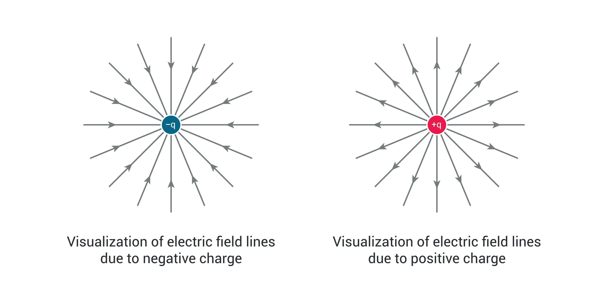
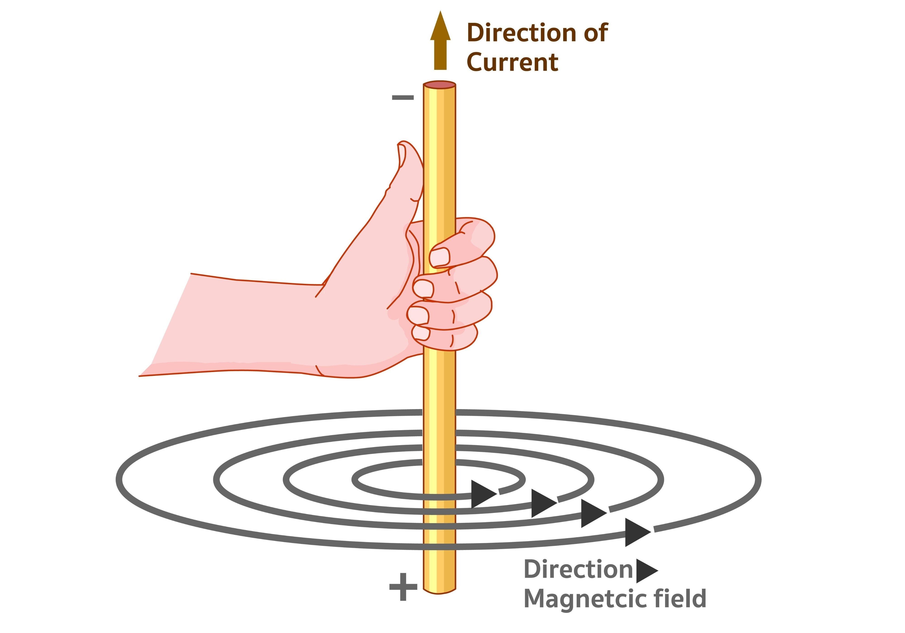

Так, стоп! Прокидайся! Ей! 👏

Я бачу, як у тебе очі злипаються, але "гроші уплачені", і я не піду звідси, доки ти не зрозумієш, чому тебе може вдарити струмом і як працює твоя зарядка до телефону. Твої батьки (або ти сам) заплатили мені, щоб я зробив з тебе людину, яка відрізняє вольт від ампера, тож халява не пройде.

Давай так: я пояснюю максимально просто, "на пальцях" і бургерах, а ти тримаєш очі відкритими хоча б 5 хвилин. Домовились?

Сьогодні у нас **Електрика та Магнетизм**. Це база. Якщо ти це проспиш, то далі в курсі фізики (і в інженерії) тобі робити нічого.

Ось тобі карта нашого "порятунку":

### 1. Електростатика: Хто кого любить?

Уяви, що заряди — це люди на вечірці.

- **Плюс (+)** і **Плюс (+)** — це два альфа-самці. Вони один одного терпіти не можуть, вони **відштовхуються**.
- **Мінус (-)** і **Мінус (-)** — те саме, конкуренція, розбігаються в різні боки.
- А от **Плюс (+)** і **Мінус (-)** — це іскра, буря, безумство. Вони **притягуються**.

Це все, що треба знати про Закон Кулона на старті. Сила їхнього кохання (або ненависті) залежить від того, наскільки вони "заряджені" і як далеко стоять один від одного.

> **Суть:** Різнойменні притягуються, однойменні відштовхуються. Все. Не спи!

---

### 2. Струм, Напруга, Опір (Закон Ома)

Це ти мусиш знати, навіть якщо тебе розбудити о 3-й ночі (що зараз і відбувається, судячи з твого вигляду).

Уявімо водопровідну трубу:

1.  **Напруга ($U$, Вольти)** — це **насос**. Це тиск, який пхає воду. Чим сильніше пхає, тим швидше летить.
2.  **Струм ($I$, Ампери)** — це сама **вода**, потік. Скільки води протекло за секунду.
3.  **Опір ($R$, Оми)** — це **іржа або сміття в трубі**. Чим тонша і брудніша труба, тим важче воді текти.

**Формула життя:**
$$I = \frac{U}{R}$$
_(Сила струму дорівнює напрузі, поділеній на опір)._

Якщо ти хочеш, щоб струм (вода) текла сильніше, ти або береш потужніший насос (більше напруги), або чистиш трубу (менше опору).

---

### 3. Магнетизм: Електрика в русі

Тепер найцікавіше. Електрика і Магнетизм — це як брат і сестра, які не можуть жити один без одного.

- Як тільки заряд (електрон) починає рухатися (бігти по дроту), навколо нього **магічним чином з'являється магнітне поле**.
- Це означає, що будь-який дріт під напругою стає магнітом.

Щоб зрозуміти, куди крутиться це поле, фізики придумали **Правило правої руки** (так, дістань руку з кишені!).
Якщо ти покажеш "клас" (великий палець) у напрямку струму, то твої зігнуті пальці покажуть, куди крутиться магнітне поле. Спробуй. Великий палець вгору — поле крутиться проти годинникової.

---

### 4. Електромагнітна індукція (Халявна енергія?)

А тепер зворотний процес. Якщо змінним магнітним полем "помахати" біля дроту, в дроті потече струм.
Саме так працюють усі електростанції світу. Ми крутимо величезний магніт біля котушки дротів — і отримуємо електрику в розетці. Це називається **Закон Фарадея**.

---

Так, студенте! Я бачу, ти ще дихаєш. Давай перевіримо, чи ти хоч щось вловив, чи я дарма тут розпинаюсь.

**Контрольне запитання на засинання:**
Якщо я збільшу напругу в розетці вдвічі (було 220, стало 440), а опір твого пальця, який ти туди запхав, не змінився — тебе вдарить струмом сильніше чи слабше? І в скільки разів?

Думай! Це закон Ома.
